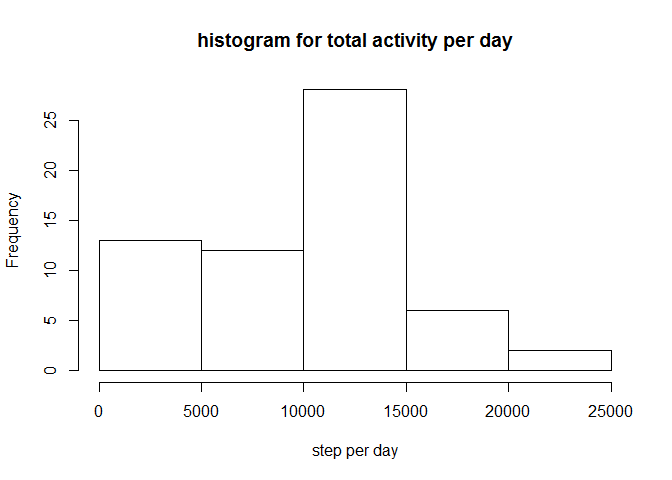
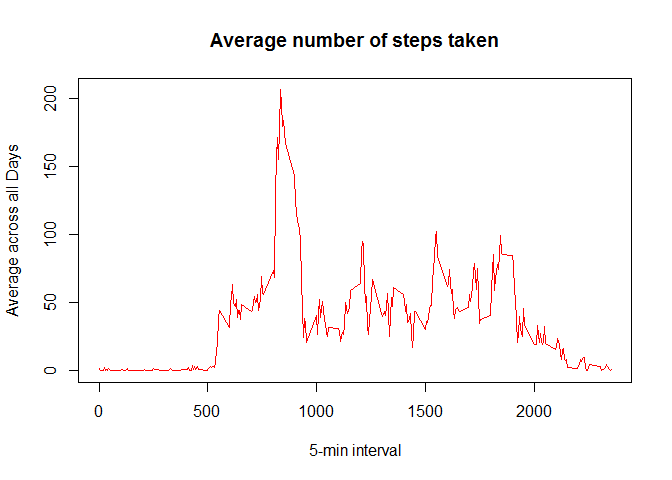

1.  load the data from local disk and display basic information

<!-- -->

    mydata <- read.csv("c:\\project\\activity_data\\activity.csv")
    summary(mydata)

    ##      steps                date          interval     
    ##  Min.   :  0.00   2012-10-01:  288   Min.   :   0.0  
    ##  1st Qu.:  0.00   2012-10-02:  288   1st Qu.: 588.8  
    ##  Median :  0.00   2012-10-03:  288   Median :1177.5  
    ##  Mean   : 37.38   2012-10-04:  288   Mean   :1177.5  
    ##  3rd Qu.: 12.00   2012-10-05:  288   3rd Qu.:1766.2  
    ##  Max.   :806.00   2012-10-06:  288   Max.   :2355.0  
    ##  NA's   :2304     (Other)   :15840

2.Histogram of the total number of steps taken each day.

    totalStepsPerDay<-aggregate(mydata$steps, by=list(date=mydata$date), FUN=sum)
    totalStepsPerDay<-aggregate(mydata$steps, by=list(date=mydata$date), FUN=sum,na.rm=TRUE)
    hist(totalStepsPerDay$x, xlab="step per day",main="histogram for total activity per day")

1.  mean and median number of steps taken each day

<!-- -->

     mean(totalStepsPerDay$x)

    ## [1] 9354.23

     median(totalStepsPerDay$x)

    ## [1] 10395

4.Time series plot of the average number of steps taken

      time_series <- tapply(mydata$steps, mydata$interval, mean, na.rm = TRUE)
      
       plot(row.names(time_series), time_series, type = "l", xlab = "5-min interval", 
          ylab = "Average across all Days", main = "Average number of steps taken", 
          col = "red")

1.  The 5-minute interval that, on average, contains the maximum number
    of steps

<!-- -->

     max_interval <-which.max(time_series)
    names(max_interval)

    ## [1] "835"

get count of the na data

    activity_NA <- sum(is.na(mydata))
    activity_NA

    ## [1] 2304

1.  replace missing data with interval average

<!-- -->

    StepsAverage <- aggregate(steps ~ interval, data = mydata, FUN = mean)
    fillNA <- numeric()
    for (i in 1:nrow(mydata)) {
        obs <- mydata[i, ]
        if (is.na(obs$steps)) {
            steps <- subset(StepsAverage, interval == obs$interval)$steps
        } else {
            steps <- obs$steps
        }
        fillNA <- c(fillNA, steps)
    }

prepare na data

     new_activity <- mydata
     new_activity$steps <- fillNA

1.  Histogram of the total number of steps taken each day after missing
    values are imputed

<!-- -->

     StepsTotal2 <- aggregate(steps ~ date, data = new_activity, sum, na.rm = TRUE)
     hist(StepsTotal2$steps, main = "Total steps by day", xlab = "day", col = "red")

mean

     mean(StepsTotal2$steps)

    ## [1] 10766.19

median

     median(StepsTotal2$steps)

    ## [1] 10766.19

8.Panel plot comparing the average number of steps taken per 5-minute
interval across weekdays and weekends

    new_activity$type_of_day <- weekdays(as.Date(new_activity$date))
    new_activity$type_of_day[new_activity$type_of_day  %in% c("Saturday","Sunday") ] <- "weekend"
    new_activity$type_of_day[new_activity$type_of_day != "weekend"] <- "weekday"
     new_activity_interval <- aggregate(steps ~ interval + type_of_day, new_activity, mean)

plot

      library(lattice)
     xyplot(steps ~ interval |type_of_day, new_activity_interval, type = "l", layout = c(1, 2), 
            xlab = "Interval", ylab = "Number of steps")

